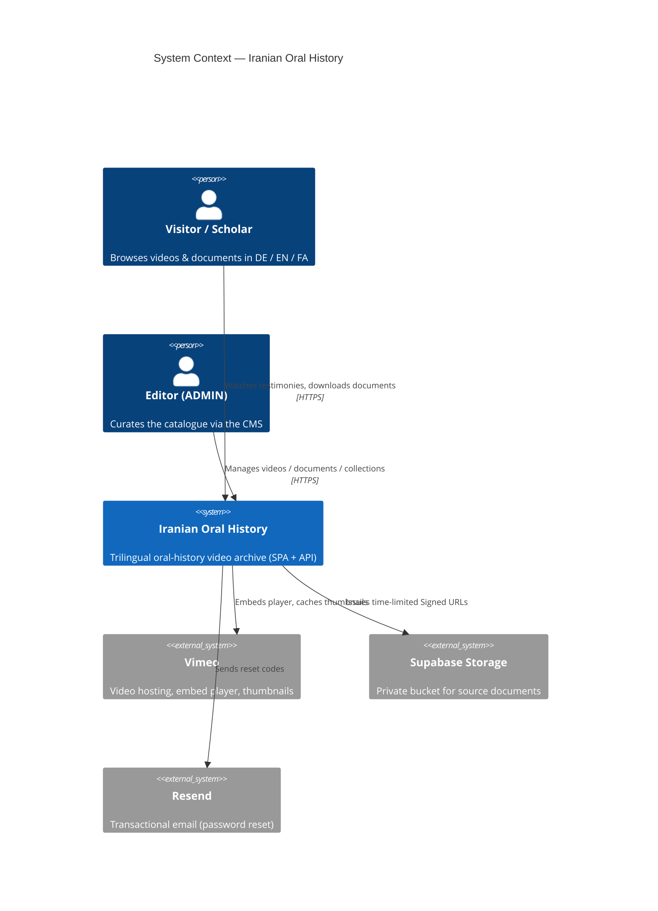
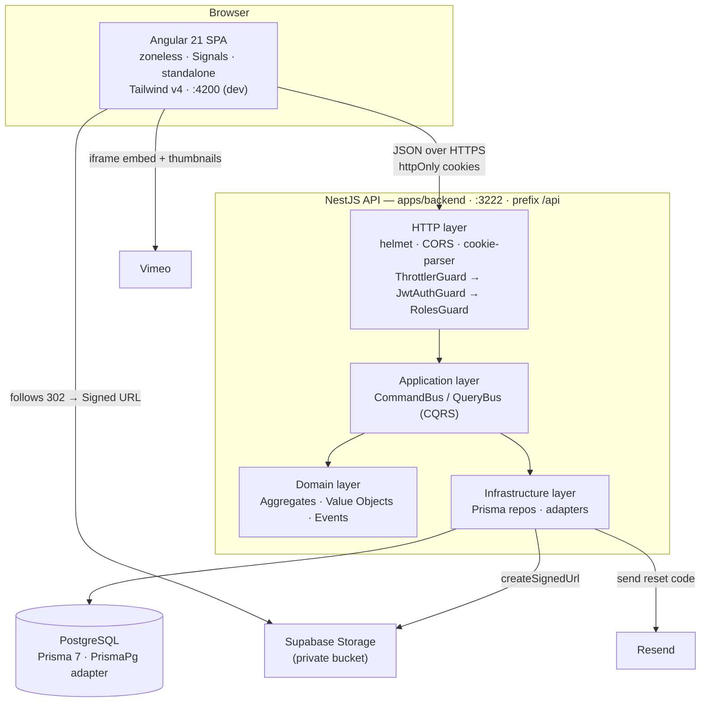
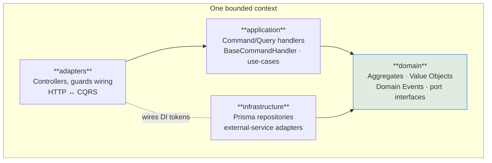
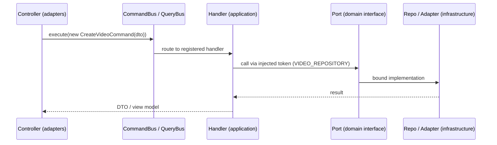
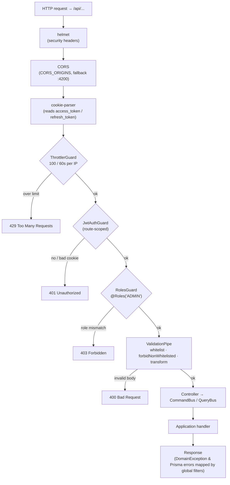

# Architecture — Iranian Oral History

> Status: living document · Scope: the whole system (backend + frontend + runtime) · Audience: engineers

This is the authoritative description of how the system is put together and why the pieces sit
where they do. It is deliberately dense: prefer the tables and diagrams, and drop into prose only
where a rule needs justification.

---

## 1. System context

The Iranian Oral History archive is a single-page web application backed by one HTTP API. The API
owns a PostgreSQL database and integrates with three external services: **Supabase Storage**
(private document files), **Resend** (transactional password-reset mail), and **Vimeo** (video
hosting, embedding, and thumbnails).



---

## 2. Runtime topology (container view)



The SPA never receives a token in a JS-readable place: access and refresh JWTs live in **httpOnly**
cookies. Document downloads never stream through the API — the API returns a **302** to a
short-lived Supabase Signed URL and the browser fetches the bytes directly.

---

## 3. The four-layer model (Clean Architecture)

Every bounded context is sliced into the same four Nx libraries. Dependencies point **inward
only**: outer layers know about inner layers, never the reverse.



| Layer | Responsibility | May import | Must NOT import |
|-------|----------------|------------|-----------------|
| **domain** | Business rules, invariants, Value Objects, domain events, **port interfaces** (`IUserRepository`, `IStorageService`, …) | domain, shared | application, adapters, infrastructure |
| **application** | Orchestration / use-cases as CQRS handlers; depends on ports, not implementations | application, domain, shared | **infrastructure**, adapters |
| **infrastructure** | Port *implementations*: Prisma repositories, Supabase / Resend / Vimeo adapters, token & hashing services | infrastructure, domain, shared | application, adapters |
| **adapters** | Delivery mechanism: NestJS controllers, guard decoration, request/response mapping | adapters, application, domain, shared | — |

The key inversion: **application depends on `domain` port interfaces and never on `infrastructure`.**
Infrastructure is bound to those ports at composition time (`AppModule`) through DI tokens.

---

## 4. Bounded contexts

| Context | Aggregate / core | Value Objects | Notable rules |
|---------|------------------|---------------|---------------|
| **Identity** | `User` | `Email` (throws `DomainException` on invalid) | Registration emits `UserRegisteredEvent`; passwords bcrypt-hashed; refresh token stored **hashed** |
| **Video** | `Video` (+ child `Document`) | `VimeoId` | Trilingual `title` / `description`; documents cascade-delete with their video |
| **Collection** | `Collection` | — | `slug` (unique), `type ∈ {PERSON, TOPIC}`, `sortOrder`; M:N to videos via `VideoCollection` |
| **Favorite** | *none — deliberate pass-through* | — | Pure `(userId, videoId)` join table; **not** an aggregate (see ADR-0003) |

**Shared kernel** (`shared-contracts` and backend `shared/*`): `DomainException`, `DomainEvent`
base, the DTOs, `TokenUtils`, and the `mustExist()` guard helper. Cross-context references are by
**id only** — no context reaches into another's tables.

```mermaid
erDiagram
    User ||--o{ UserFavorite : has
    Video ||--o{ UserFavorite : "is favorited in"
    Video ||--o{ Document : owns
    Video ||--o{ VideoCollection : "listed in"
    Collection ||--o{ VideoCollection : groups
    User ||--o| PasswordResetToken : "has at most one"

    User { uuid id PK; string email UK; string hashedPassword; string hashedRefreshToken; enum role }
    Video { uuid id PK; string vimeoId UK; string titleDe; string titleEn; string titleFa }
    Document { uuid id PK; string title; string storagePath; uuid videoId FK }
    Collection { uuid id PK; string slug UK; enum type; int sortOrder }
    VideoCollection { uuid videoId FK; uuid collectionId FK }
    UserFavorite { uuid userId FK; uuid videoId FK }
    PasswordResetToken { uuid id PK; uuid userId UK FK; string tokenHash; datetime expiresAt }
```

---

## 5. Module-boundary enforcement (ESLint)

Boundaries are not a convention — they are compiled. `@nx/enforce-module-boundaries` fails the lint
gate on any illegal import, using scope tags on each library's `project.json`.

| Source tag | May depend on |
|------------|---------------|
| `type:domain` | `type:domain`, `type:shared` |
| `type:application` | `type:application`, `type:domain`, `type:shared` — **not** `type:infrastructure` |
| `type:infrastructure` | `type:infrastructure`, `type:domain`, `type:shared` |
| `type:adapters` | `type:adapters`, `type:application`, `type:domain`, `type:shared` |
| `platform:backend` | `platform:backend`, `platform:universal` |
| `platform:frontend` | `platform:frontend`, `platform:universal` |

Two orthogonal tag families are used together: **`type:*`** enforces the Clean-Architecture
dependency rule, and **`platform:*`** keeps backend-only code (Node, Prisma) out of the browser
bundle and vice-versa, with `platform:universal` for genuinely shared contracts.

---

## 6. Key patterns

### 6.1 CQRS
Controllers hold no business logic. They translate an HTTP request into a **Command** or **Query**
and dispatch it on `@nestjs/cqrs`'s `CommandBus` / `QueryBus`. Handlers live in the application
layer; write handlers extend `BaseCommandHandler`.



### 6.2 Domain events
State changes publish domain events through `@nestjs/event-emitter` (e.g. `UserRegisteredEvent`,
`VideoCreatedEvent`). Handlers stay small; side-effects (welcome flows, cache priming) subscribe
independently, keeping the write path decoupled.

### 6.3 Value Objects
Invariants live in Value Objects, not in services. `Email` and `VimeoId` validate on construction
and throw `DomainException`, so an invalid value can never exist in the domain. The global
exception filter maps `DomainException` to the right HTTP status.

### 6.4 Ports & Adapters (DI tokens)
The application layer talks to capabilities, not classes. Each capability is a DI token bound to a
concrete infrastructure implementation in `AppModule`.

| Token | Capability | Bound implementation (infrastructure) |
|-------|------------|----------------------------------------|
| `USER_REPOSITORY` | User persistence | Prisma user repository |
| `VIDEO_REPOSITORY` | Video + Document persistence | Prisma video repository |
| `COLLECTION_REPOSITORY` | Collection persistence | Prisma collection repository |
| `FAVORITE_REPOSITORY` | Favorite join persistence | Prisma favorite repository |
| `TOKEN_SERVICE` | Sign / verify JWTs | JWT token service |
| `PASSWORD_HASHER` | Hash / compare passwords | bcrypt hasher |
| `EMAIL_SERVICE` | Send transactional mail | Resend adapter |
| `STORAGE_SERVICE` | Issue Signed URLs | Supabase Storage adapter |
| `PASSWORD_RESET_TX` | Atomic reset unit-of-work | Prisma `$transaction` wrapper (ADR-0007) |

---

## 7. Request lifecycle & the guard chain

Every request enters through the `/api` prefix and passes a fixed chain. Guards run in registration
order; the first to reject short-circuits the request.



Notes:
- **ThrottlerGuard is global** (registered in `AppModule` via `APP_GUARD`); `JwtAuthGuard` and
  `RolesGuard` are applied per route with `@UseGuards(...)` / `@Roles('ADMIN')`.
- `JwtAuthGuard` reads the **access-token** cookie; the `/auth/refresh` route instead uses
  `JwtRefreshGuard`, which reads and verifies the **refresh-token** cookie.
- Public reads (`GET /videos`, `GET /videos/:id`, `GET /collections`,
  `GET /documents/:docId/signed-url`) carry no auth guard. The document signed-url route is public
  archive content (ADR-0008) and additionally keeps a tight per-route throttle (30/60s) plus
  unguessable UUID `docId`s as its enumeration defense.

---

## 8. Authentication & authorization flow

httpOnly cookies, short-lived access + long-lived hashed refresh, delete-before-write on reset.

```mermaid
sequenceDiagram
    autonumber
    participant U as Browser (SPA)
    participant A as AuthController
    participant S as Identity application
    participant DB as PostgreSQL

    Note over U,DB: Login
    U->>A: POST /api/auth/login {email, password}
    A->>S: LoginCommand
    S->>DB: verify bcrypt hash
    S-->>A: { accessToken (15m), refreshToken (7d) }
    A-->>U: Set-Cookie access_token + refresh_token (httpOnly)<br/>store refresh **hashed** in DB

    Note over U,DB: Silent refresh (access expired)
    U->>A: POST /api/auth/refresh (refresh cookie)
    A->>S: RefreshTokensCommand (JwtRefreshGuard verified)
    S->>DB: compare presented refresh vs stored hash
    S-->>A: new token pair
    A-->>U: rotate both cookies

    Note over U,DB: Password reset (atomic — ADR-0007)
    U->>A: POST /api/auth/forgot-password {email}
    A->>S: emails a 6-digit code (Resend); PasswordResetToken row (hashed)
    U->>A: POST /api/auth/verify-reset-code {email, code}
    U->>A: POST /api/auth/reset-password {email, code, newPassword}
    A->>S: ResetPasswordCommand → PASSWORD_RESET_TX
    S->>DB: $transaction( delete token + set new hash )
```

**RBAC.** After authentication, `RolesGuard` compares the JWT's `role` claim against the route's
`@Roles(...)`. All mutations of videos, documents, and collections require `ADMIN`; favourites and
`GET /users/me` require any authenticated `USER`.

---

## 9. Cross-cutting concerns

| Concern | Mechanism |
|---------|-----------|
| **Input validation** | Global `ValidationPipe { whitelist, forbidNonWhitelisted, transform }`; nested trilingual DTOs use `@ValidateNested()` + `@Type()`. Unknown fields → 400. |
| **Error mapping** | Global filters: `DomainExceptionFilter` (domain → HTTP) and `PrismaExceptionFilter` — P2002 → **409**, P2025 → **404**, P2003 → **400**. |
| **Security headers** | `helmet` on every response. |
| **Rate limiting** | `@nestjs/throttler`, global 100 req / 60 s per IP; sensitive routes can tighten via `@Throttle()`. |
| **CORS** | Driven by `CORS_ORIGINS` (comma-separated), fallback `http://localhost:4200`, `credentials: true`. |
| **Secrets fail-fast** | `validateEnv()` runs before Nest boots: rejects missing `DATABASE_URL` / Supabase / Resend keys, and rejects `JWT_SECRET` / `JWT_REFRESH_SECRET` that are missing, trivial (`secret`, `changeme`, …), shorter than 32 chars, or identical to each other. |
| **Transactions** | Multi-step writes run inside a single Prisma `$transaction` behind the `PASSWORD_RESET_TX` port (ADR-0007). |
| **i18n / RTL** | Content is trilingual by column (`*De/*En/*Fa`); the SPA language switcher toggles `dir="rtl"` and `lang="fa"` for Farsi. |

---

## 10. Frontend surface

Angular 21, zoneless, Signals, standalone components, Tailwind v4.

| Route | Purpose | Guard |
|-------|---------|-------|
| `/` | Home (GSAP animations) | — |
| `/videos` | Catalogue: Vimeo embed, search, lightbox, document downloads | — |
| `/about` | 9-section scholarly page | — |
| `/boulorian` | Persian primary source | — |
| `/login`, `/register`, `/forgot-password` | Auth flows | — |
| `/admin` | CMS for videos / documents / collections / categories | `adminGuard` + RBAC |

---

## 11. Persistence

PostgreSQL through **Prisma 7** with the `PrismaPg` driver adapter (`@prisma/adapter-pg`); schema
at `libs/backend/shared/database/prisma/schema.prisma`. Models: `User`, `Video`, `Document`,
`Collection`, `VideoCollection` (M:N pivot), `UserFavorite` (M:N pivot), `PasswordResetToken`.
Trilingual content is stored as `*De/*En/*Fa` columns (ADR-0004). `onDelete: Cascade` links
`Document → Video`, both pivots to their parents, and `PasswordResetToken → User`.

---

## 12. Operations

- **Health.** `GET /api/health` gives liveness/readiness and pings the database — the probe target
  for the host's health check and uptime monitoring.
- **Packaging & deploy.** Frontend deploys as a static build to Vercel; the backend runs as a Node
  service on a PaaS host (e.g. Render); PostgreSQL and file storage are provided by Supabase. Each
  `git push` to `main` triggers an automatic build and deploy — no separate CI pipeline.
- **Quality bar.** 723 Jest unit tests across 33 projects, 89 backend-e2e (supertest against real
  Postgres), 98 Playwright e2e (Chromium + Firefox), 0 lint errors.

---

*Decisions referenced above are recorded in [`adr/`](./adr/). The HTTP contract is specified in
[`openapi.yaml`](./openapi.yaml).*
